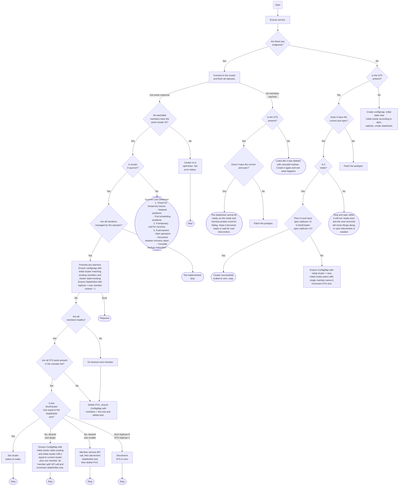

# Design

This document describes the interaction between `EtcdCluster` custom resources and other Kubernetes
primitives and gives an overview of the underlying implementation.

## Reconciliation flowchart

