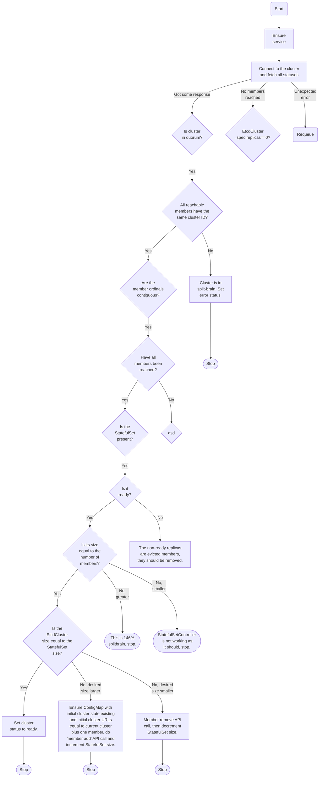

# Design

This document describes the interaction between `EtcdCluster` custom resources and other Kubernetes
primitives and gives an overview of the underlying implementation.

## Reconciliation flowchart

<!---
TODO: Commented this out in favor of flowchart, but some things might come back later
## Creating a cluster

When a user adds an `EtcdCluster` resource to the Kubernetes cluster, the reconciler observes an
`EtcdCluster` object with an empty list of conditions in its status. This prompts it to fill the
status field with a set of default conditions, including an "etcd not ready" condtion with the
reason "waiting for first quorum".

TODO: we need a diagram of possible state transitions for the various conditions. We also need to
better handle the possibility of a bad status being passed when creating a cluster. We should write
tests, where an etcd cluster with a non-empty status field is applied to the cluster. We should also
try to find a way to determine that the cluster is not ready and/or waiting for first quorum without
assuming that a new cluster has an empty status field.

Next, the operator creates the following objects:

* A configmap holding configuration values for bootstrapping a new cluster (`ETCD_INITIAL_CLUSTER_*` environment variables).
* A headless service for intra-cluster communication.
* A statefulset with pods for the individual members of the etcd cluster.
* A service for clients' access to the etcd cluster.
* A pod disruption budget to prevent the etcd cluster from losing quorum.

If the above is successful, the etcd cluster status is set to `Initialized`.

If no error happens, the statefulset is most likely not yet ready and the status is updated with "etcd cluster not ready" as it is "waiting for first quorum". Once the statefulset is ready, a reconciliation is triggered again, since the child statefulset is also being watched. Finally, the status is updated once again to a "ready" condition.
--->
